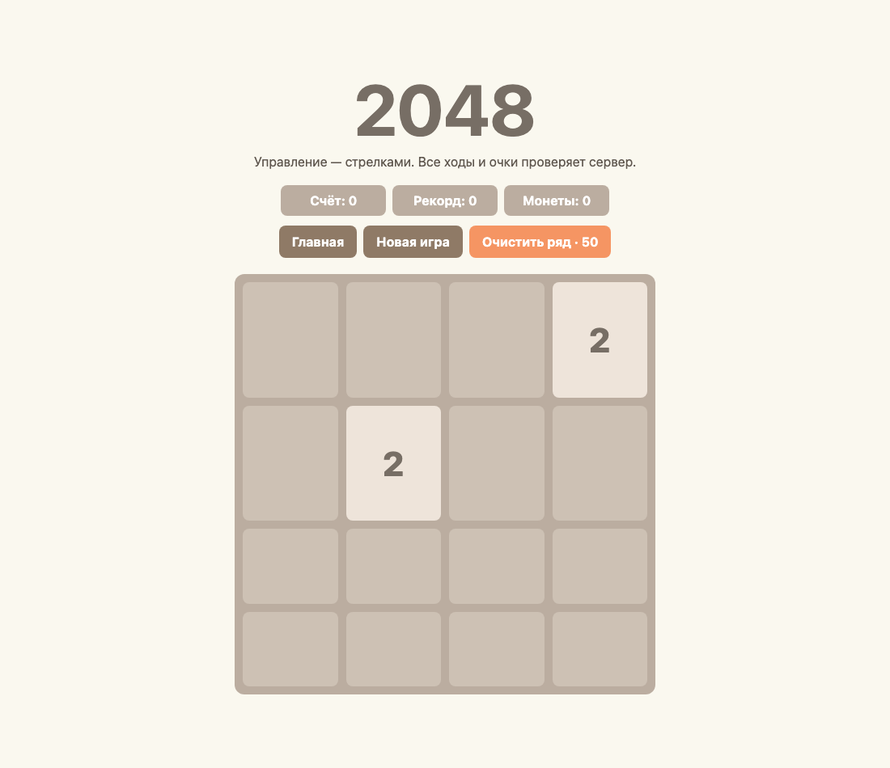

# 2048 server

Классическая 2048 с аккаунтами, таблицей лидеров и небольшой внутриигровой механикой: за успешные слияния начисляются монеты, а за 50 монет можно очистить верхний ряд.

Главное отличие этой версии от обычной браузерной игры — сервер авторитетен. Клиент отправляет только направление хода. Новая доска, слияния, счёт, рекорд и баланс считаются на Node.js, поэтому их нельзя подменить обычным запросом из DevTools.



## Что внутри

- Express и Passport Local для HTTP-сервера и аккаунтов;
- MongoDB для пользователей, рекордов и баланса;
- отдельный игровой движок без зависимости от браузера;
- состояние текущей партии в серверной сессии;
- demo-режим, которому не нужны MongoDB и регистрация;
- тесты правил слияния, перемещения, окончания игры и очистки ряда.

## Быстрый запуск демо

```bash
npm install
npm run demo
```

После запуска откройте [http://localhost:3000](http://localhost:3000). Demo-аккаунт создаётся в памяти и сбрасывается при перезапуске процесса.

## Обычный режим

Скопируйте пример настроек и задайте свой session secret:

```bash
cp .env.example .env
npm install
npm start
```

```dotenv
PORT=3000
MONGODB_URI=mongodb://127.0.0.1:27017/game2048
SESSION_SECRET=replace-with-a-long-random-value
DEMO_MODE=false
```

Файл `.env` не попадает в git.

## Проверка

```bash
npm test
```

Игровая логика находится в [`game/engine.js`](game/engine.js), HTTP API — в [`server.js`](server.js), тонкий браузерный клиент — в [`public/script.js`](public/script.js).
